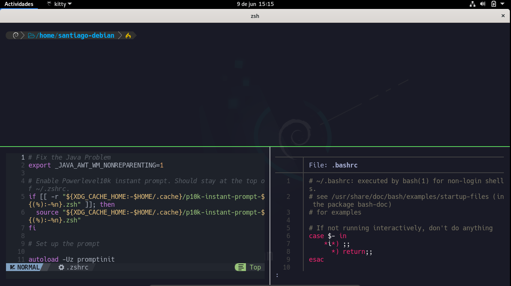

# Descripción

Configuración de la terminal [Kitty](https://sw.kovidgoyal.net/kitty/) para distribuciones Linux con las [Hack Nerd Fonts](https://www.nerdfonts.com/), la [Powerlevel10K](https://github.com/romkatv/powerlevel10k), y una zsh como shell. Además del editor de texto nvim con el tema de [Nvchad](https://nvchad.com/) y el plugin [fzf](https://github.com/junegunn/fzf).


# Contenido
- [Instalación manual](#instalacion-manual)
- [Instalación automática](#instalacion-automatica)
- [Lista de shortcuts](#lista-de-shortcuts)

# Instalación manual
1. Actualización de paquetes: en primer lugar se actualizará todos los paquetes del sistema con el siguiente comando.

```bash
sudo apt update && sudo apt upgrade
```

2. Instalación de paquetes necesarios: ahora se instalará los paquetes necesarios.
- zsh
- zsh-syntax-highlighting
- zsh-autosuggestions
- bat
- git

```bash
sudo apt install zsh zsh-syntax-highlighting zsh-autosuggestions bat git -y
```

3. Instalación de la terminal Kitty: en la página oficial de [Kitty](https://sw.kovidgoyal.net/kitty/binary/) se encuentra los pasos para realizar la instalación:
```bash
curl -L https://sw.kovidgoyal.net/kitty/installer.sh | sh /dev/stdin
sudo ln -s -f /home/<usuario_de_bajos_privilios>/.local/kitty.app/bin/kitty /bin/kitty
```
4. Instalación de las _Hack Nerd Fonts_: como **usuario privilegiado (root)** nos dirigimos al directorio _/usr/share/fonts_ (o el equivalente en la distribución de trabajo) y descargamos el comprimido de las _Hack Nerd Fonts_ de la página oficial ([Hack Nerd Fonts](https://www.nerdfonts.com/)), posteriormente descomprimimos el archivo _.zip_ y lo eliminamos.

```bash
cd /usr/share/fonts
wget https://github.com/ryanoasis/nerd-fonts/releases/download/v3.0.2/Hack.zip
unzip Hack.zip
rm Hack.zip
```

5. Cambio de shell: ahora cambiamos el tipo de shell por defecto para el usuario _root_ y los usuarios con bajos privilegios.

```bash
usermod --shell /usr/bin/zsh root
usermod --shell /usr/bin/zsh <usuario_de_bajos_privilegios>
```

6. Configuración del archivo ***.zshrc***: como usuario **no privilegiado** editamos (o creamos en caso de no existir) el archivo ubicado en la ruta *~/.zshrc*, eliminamos cualquier contenido en caso de existir y pegamos el contenido del archivo `.zshrc` disponible en este repositorio. _Créditos: [s4vitar](https://github.com/s4vitar)_
7. Instalación del plugin _sudo_: como **usuario privilegiado (root)** creamos una carpeta llamada _zsh-sudo_ en el directorio _/usr/share_, posteriormente ingresamos a dicha carpeta y descargamos el plugin [zsh sudo](https://github.com/ohmyzsh/ohmyzsh/blob/master/plugins/sudo/sudo.plugin.zsh).

```bash 
mkdir /usr/share/zsh-sudo
cd /usr/share/zsh-sudo
wget https://raw.githubusercontent.com/ohmyzsh/ohmyzsh/master/plugins/sudo/sudo.plugin.zsh
```

8. Instalación de _lsd_: el paquete de _lsd_ esta disponible como paquete en varias distribuciones de linux [(consulta aquí)](https://github.com/lsd-rs/lsd), en el caso de distribuciones basadas en Debian, es necesario descargar el archivo ***lsd_x.x.x_amd64.deb*** y realizar la instalación manual. Los siguientes comando se deben ejecutar como **usuario privilegiado (root)**.

```bash
su root
wget https://github.com/lsd-rs/lsd/releases/download/0.23.1/lsd_0.23.1_amd64.deb
dpkg -i lsd_0.23.1_amd64.deb 
rm lsd_0.23.1_amd64.deb
```

9. Configuración de la kitty: para configurar la kitty se deben crear dos archivos (_kitty.conf_ y _color.ini_) en la ruta `~/.config/kitty_ `, los archivos se encuentran disponibles en este repositorio. 
10. Instalación de la Powerlevel10K:  en el repositorio [powerlevel10k](https://github.com/romkatv/powerlevel10k) se encuentra las instrucciones para el proceso de instalación manual de la powerlevel10k.
	**Nota**: esto de debe ejecutar como **usuario no privilegiado**.

```bash
git clone --depth=1 https://github.com/romkatv/powerlevel10k.git ~/powerlevel10k
```

Una vez ejecutados los anteriores comandos se procede a la configuración de la powerlevel10k ejecutando el comando `zsh`.
###### Mi configuración
- Prompt style: 2 (Classic)
- Character set: 1 (Unicode)
- Prompt color: 3 (Dark)
- Show current time: n (No)
- Prompt separators: 1 (Angled)
- Prompt heads: 1 (Sharp)
- Prompt tails: 5 (Round)
- Prompt height: 1 (One line)
- Prompt spacing: 2 (Sparse)
- Icons: 2 (Many icons)
- Prompt flow: 2 (Fluent)
- Enable transient prompt: yes
- Instant prompt mode: 1 (Verbose)

11. Ajustes adicionales a la powerlevel10k: se debe comentar las líneas 45-109 del archivo ***.p10k.zsh*** , además añade lo siguiente debajo de la línea 36.

```bash 
command_execution_time
context
```

12. Link simbólico para para el archivo ._zshrc_ de root: ahora se realiza un link simbólico para que el archivo _.zshrc_ de root sea el mismo que el del usuario de bajos privilegios. El comando sigueinte se debe ejecutar como **usuario privilegiado (root)**.

```bash
sudo ln -s -f /home/<usuario>/.zshrc /root/.zshrc
```

13. Instalación de la powerlevel10k para root:  ahora se realizará la configuración de la powerlevel10k para el usuario root  de la siguiente manera.  El comando sigueinte se debe ejecutar como **usuario privilegiado (root)**.

```bash
sudo git clone --depth=1 https://github.com/romkatv/powerlevel10k.git ~/powerlevel10k
pk10 configure
```

Y ahora debe repetir la configuración realizada en el [paso 10](#mi-configuracion). 

14. Ajustes adicionales a la powerlevel10k: se debe comentar las líneas 45-109 del archivo ***.p10k.zsh*** del directorio root (/root/.p10k.zsh) , además añade lo siguiente debajo de la línea 36.

```bash 
command_execution_time
context
````

Además,  comenta la línea 913 y edita el icono de la línea 900 (escoge uno en la [sección de iconos](https://www.nerdfonts.com/cheat-sheet) de la página Nerdfonts)

15. Instalación de la fzf: en el repositorio [fzf](https://github.com/junegunn/fzf) está el proceso de instalación usando git, este proceso se debe ejecutar para **los usuarios con bajos y altos privilegios (ambos)**.

```bash
git clone --depth 1 https://github.com/junegunn/fzf.git ~/.fzf
~/.fzf/install
```

En el proceso de instalación se da la opción "yes" en todos los casos. 

16. Instalación de Nvchad: para esta instalación se requiere **neovim 0.9.0**, se descarga [aquí](https://github.com/neovim/neovim/releases/tag/v0.9.0), una vez se descargue el binario ejecutable asegúrese que el binario _nvim_ este en una ruta del PATH (recomendada /usr/bin/) y además que el binario cuente con el permiso 755.

```bash
su root
cd /usr/bin
mv /home/<usuario>/Descargas/nvim.appimage ./nvim
chmod 755 nvim
```

Posteriormente, se instalan los siguientes paquetes.

```bash
sudo apt install build-essential nodejs npm
```

Finalmente se debe seguir las [instrucciones de instalación](https://nvchad.com/docs/quickstart/install) de la página oficial de Nvchad. Este comando se debe ejecutar para  **los usuarios con bajos y altos privilegios (ambos)**.

```bash
git clone https://github.com/NvChad/NvChad ~/.config/nvim --depth 1 && nvim
```

# Instalación automática
Para realizar la instalación deforma automática puedes ejecutar el script `install.sh` como **usuario de bajos privilegios** disponible en este repositorio. En caso de no tener permisos de ejecución se asigna y se ejecuta.
```bash
git clone https://github.com/santiago-rincon/Linux_terminal.git
cd Linux_terminal
chmod u+x install.sh
./install.sh
```
# Lista de shortcuts 

<table style="font-family: arial, sans-serif; border-collapse: collapse; width: 100%;">
	<tr style="border: 1px solid #dddddd; text-align: left; padding: 8px;">
		<td style="border: 1px solid #dddddd; text-align: left; padding: 8px;"><strong>Shortcut</strong></td>
		<td style="border: 1px solid #dddddd; text-align: left; padding: 8px;"><strong>Acción</strong></td>
	</tr>
	<tr style="border: 1px solid #dddddd; text-align: left; padding: 8px;">
		<td style="border: 1px solid #dddddd; text-align: left; padding: 8px;">ctrl + shift + enter</td>
		<td style="border: 1px solid #dddddd; text-align: left; padding: 8px;">Abre una nueva terminal (misma ventana)</td>
	</tr>
	<tr style="border: 1px solid #dddddd; text-align: left; padding: 8px;">
		<td style="border: 1px solid #dddddd; text-align: left; padding: 8px;">ctrl + &ltflechas de dirección&gt</td>
		<td style="border: 1px solid #dddddd; text-align: left; padding: 8px;">Desplazamiento entre ventanas</td>
	</tr>
	<tr style="border: 1px solid #dddddd; text-align: left; padding: 8px;">
		<td style="border: 1px solid #dddddd; text-align: left; padding: 8px;">ctrl + shift + w</td>
		<td style="border: 1px solid #dddddd; text-align: left; padding: 8px;">Cierra la ventana actual</td>
	</tr>
	<tr style="border: 1px solid #dddddd; text-align: left; padding: 8px;">
		<td style="border: 1px solid #dddddd; text-align: left; padding: 8px;">ctrl + shift + r</td>
		<td style="border: 1px solid #dddddd; text-align: left; padding: 8px;">Cambia de tamaño los paneles</td>
	</tr>
	<tr style="border: 1px solid #dddddd; text-align: left; padding: 8px;">
		<td style="border: 1px solid #dddddd; text-align: left; padding: 8px;">ctrl + shift + l</td>
		<td style="border: 1px solid #dddddd; text-align: left; padding: 8px;">Alterna entre los diferentes layouts</td>
	</tr>
	<tr style="border: 1px solid #dddddd; text-align: left; padding: 8px;">
		<td style="border: 1px solid #dddddd; text-align: left; padding: 8px;">ctrl + shift + t</td>
		<td style="border: 1px solid #dddddd; text-align: left; padding: 8px;">Nueva terminal en la powerline</td>
	</tr>
		<tr style="border: 1px solid #dddddd; text-align: left; padding: 8px;">
		<td style="border: 1px solid #dddddd; text-align: left; padding: 8px;">ctrl + shift + alt + t</td>
		<td style="border: 1px solid #dddddd; text-align: left; padding: 8px;">Renombra la terminal actual en la powerline</td>
	</tr>
	<tr style="border: 1px solid #dddddd; text-align: left; padding: 8px;">
		<td style="border: 1px solid #dddddd; text-align: left; padding: 8px;">ctrl + ,.</td>
		<td style="border: 1px solid #dddddd; text-align: left; padding: 8px;">Cambia de posición las pestañas de la powerline</td>
	</tr>
	<tr style="border: 1px solid #dddddd; text-align: left; padding: 8px;">
		<td style="border: 1px solid #dddddd; text-align: left; padding: 8px;">ctrl + t</td>
		<td style="border: 1px solid #dddddd; text-align: left; padding: 8px;">Busqueda recursiva</td>
	</tr>
	<tr style="border: 1px solid #dddddd; text-align: left; padding: 8px;">
		<td style="border: 1px solid #dddddd; text-align: left; padding: 8px;">ctrl + alt + clic</td>
		<td style="border: 1px solid #dddddd; text-align: left; padding: 8px;">Selección en forma rectangular</td>
	</tr>
	<tr style="border: 1px solid #dddddd; text-align: left; padding: 8px;">
		<td style="border: 1px solid #dddddd; text-align: left; padding: 8px;">ctrl + r</td>
		<td style="border: 1px solid #dddddd; text-align: left; padding: 8px;">Historial de comandos</td>
	</tr>
	<tr style="border: 1px solid #dddddd; text-align: left; padding: 8px;">
		<td style="border: 1px solid #dddddd; text-align: left; padding: 8px;">ctrl + shift + z</td>
		<td style="border: 1px solid #dddddd; text-align: left; padding: 8px;">Zoom a la ventana actual</td>
	</tr>
	<tr style="border: 1px solid #dddddd; text-align: left; padding: 8px;">
		<td style="border: 1px solid #dddddd; text-align: left; padding: 8px;">f1</td>
		<td style="border: 1px solid #dddddd; text-align: left; padding: 8px;">Copiar al buffer a</td>
	</tr>
	<tr style="border: 1px solid #dddddd; text-align: left; padding: 8px;">
		<td style="border: 1px solid #dddddd; text-align: left; padding: 8px;">f2</td>
		<td style="border: 1px solid #dddddd; text-align: left; padding: 8px;">Pegar del buffer a</td>
	</tr>
	<tr style="border: 1px solid #dddddd; text-align: left; padding: 8px;">
		<td style="border: 1px solid #dddddd; text-align: left; padding: 8px;">f3</td>
		<td style="border: 1px solid #dddddd; text-align: left; padding: 8px;">Copiar al buffer b</td>
	</tr>
	<tr style="border: 1px solid #dddddd; text-align: left; padding: 8px;">
		<td style="border: 1px solid #dddddd; text-align: left; padding: 8px;">f4</td>
		<td style="border: 1px solid #dddddd; text-align: left; padding: 8px;">Pegar del buffer a</td>
	</tr>
</table>
